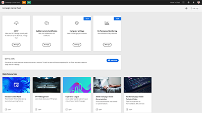

# Adobe Campaign Standard – översikt

Adobe Campaign erbjuder en plattform för att utforma kundupplevelser över flera kanaler och tillhandahåller en miljö för visuell kampanjorkestrering, interaktionshantering i realtid och körning över flera kanaler. Den här användarhandboken innehåller videor och självstudiekurser om de många funktioner och möjligheter som finns i Adobe Campaign Standard.

## Nyheter

* **[Schemalägg meddelanden](/help/communication-channels/email/schedule-messages.md)**

  *Lär dig hur du schemalägger en e-postleverans.*

* **[Skicka en korrektur](/help/communication-channels/email/send-a-proof.md)**

  *Lär dig hur du testar ett e-postmeddelande innan du skickar det till de slutliga mottagarna.*

* **[De tio bästa metoderna för att marknadsförare ska lyckas med Adobe Campaign](/help/strategy/10-best-practices-for-marketers.md)**

  *Lär dig de tio bästa metoderna för att hjälpa yrkesverksamma inom Adobe Campaign att låsa upp och påskynda den digitala konsumentomvandlingen och få en bättre upplevelse för sina kunder.*

## Personalens val

<table>
<tr>
  <td>
    
    

      <a href="./communication-channels/email/profile-substitution.md">
    <strong>Profilersättning – testa e-postmeddelanden med målinriktade profiler (video)</strong>
    </a>
    

    

    <em>Lär dig hur du skickar ett bevis för granskning med en exakt återgivning av meddelandet som profilen får.</em>
    

  </td>
   <td>
    
    

    <a href="https://experienceleague.adobe.com/docs/control-panel-learn/tutorials/control-panel-overview.html?lang=sv">
    <strong>Kontrollpanel (videor)</strong>
    </a>
    

    

    <em> Hantera inställningar och spåra användning av instanser med kontrollpanelen för att arbeta effektivare som administratör.</em>
    

  </td>
  <td>
    
    

      <a href="https://experienceleague.adobe.com/docs/campaign-standard-learn/getting-started-with-push-notifications-android/introduction.html?lang=sv">
    <strong>Självstudiekurs: Komma igång med push-meddelanden för Android™</strong>
    </a>
    

    

    <em>Den här självstudiekursen visar steg för steg hur du skickar push-meddelanden från Adobe Campaign och tar emot dessa meddelanden i Android™-appen. </em>
    

  </td>
</tr>
</table>

