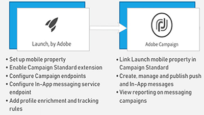

# Översikt

Adobe Campaign är en plattform för att utforma kundupplevelser i flera kanaler och erbjuder en miljö för visuell kampanjsamordning, interaktionshantering i realtid och kanalövergripande körning. Den här användarhandboken innehåller videor och självstudiekurser om alla funktioner i Adobe Campaign Standard.

## Nyheter

* **[Extern API-aktivitet](/help/managing-processes-and-data/data-management-activities/external-api-activity.md)**    
   *Lär dig hur du konfigurerar och kör ett arbetsflöde med aktiviteten Externt API.*

* **[Profilersättning - Testa e-postmeddelanden med målprofiler](/help/communication-channels/email/profile-substitution.md)**    
   *Lär dig hur du skickar ett korrektur för granskning med en exakt representation av meddelandet som profilen kommer att få.*

* **[Kontrollpanelen - Google TXT-posthantering](/help/administrating/control-panel/google-txt-record-management.md)**    
   *Lär dig hur du lägger till Google TXT-webbplatsverifieringspost i alla dina underdomäner som används för att skicka e-post till GMAIL-adresser via Kontrollpanelen för Campaign.*

* **[Självstudiekurs: Komma igång med push-meddelanden för Android](https://docs.adobe.com/content/help/en/campaign-standard-learn/getting-started-with-push-notifications-android/introduction.html)**    
   *I den här självstudiekursen får du hjälp med att skicka push-meddelanden från Adobe Campaign och ta emot dessa meddelanden i din Android-app.*

## Personalval

<table>
<tr>
  <td>
    
    

      <a href="./communication-channels/mobile/in-app/in-app-message-overview.md">
    <strong>Meddelanden i appen (självstudiekurs)</strong>
    </a>
    

    

    <em>Meddelanden i appen är en kanal som gör att du kan visa ett meddelande när användaren är aktiv i ett mobilprogram.</em>
    

  </td>
   <td>
    
    

      <a href="./designing-content/email-designer/email-designer-overview.md">
    <strong>E-postdesigner (videor)</strong>
    </a>
    

    

    <em>Med e-postdesignern kan du snabbt och enkelt skapa individuellt anpassade e-postmeddelanden.</em>
    

  </td>
  <td>
    
    

      <a href="./designing-content/product-listings-in-transactional-email.md">
    <strong>Produktlistor (självstudiekurs)</strong>
    </a>
    

    

    <em>Skapa transaktionsmejl med en lista över produkter och erbjudanden. </em>
    

  </td>
</tr>
</table>

## Ytterligare resurser

* [Dokumentation](https://docs.adobe.com/content/help/en/campaign-standard/using/campaign-standard-home.html)
