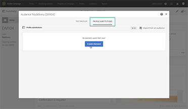
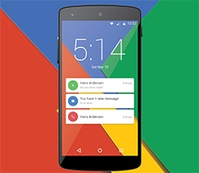

# Översikt

Adobe Campaign erbjuder en plattform för att utforma kundupplevelser över flera kanaler och levererar en miljö för visuell kampanjorkestrering, interaktionshantering i realtid och körning över flera kanaler. Den här användarhandboken innehåller videor och självstudiekurser om de många funktioner och möjligheter som finns i Adobe Campaign Standard.

## Nyheter

* **[Hantera GPG-nycklar](/help/administrating/control-panel/gpg-key-management/gpg-key-management-overview.md)**

   *Läs mer om hur du skapar och installerar ett offentligt/privat nyckelpar på en angiven instans i Campaign för att kryptera utgående data. Samt även hur du importerar och installerar en offentlig nyckel på en instans i Campaign för att dekryptera inkommande data.*

* **[Aktiviteten Externt API](/help/managing-processes-and-data/data-management-activities/external-api-activity.md)**

   *Läs mer om hur du konfigurerar och kör ett arbetsflöde med aktiviteten Externt API.*

## Personalens val

<table>
<tr>
  <td>
    
    

      <a href="./communication-channels/email/profile-substitution.md">
    <strong>Profilersättning – testa e-postmeddelanden med målinriktade profiler (video)</strong>
    </a>
    

    

    <em>Läs mer om hur du skickar ett korrektur för granskning med en exakt återgivning av meddelandet som profilen sedan får.</em>
    

  </td>
   <td>
    
    

      <a href="./designing-content/email-designer/email-designer-overview.md">
    <strong>Email Designer (videor)</strong>
    </a>
    

    

    <em>Med Email Designer kan du snabbt och enkelt skapa individuellt personaliserade e-postmeddelanden.</em>
    

  </td>
  <td>
    
    

      <a href="https://docs.adobe.com/content/help/sv-SE/campaign-standard-learn/getting-started-with-push-notifications-android/introduction.html">
    <strong>Självstudiekurs: komma igång med push-meddelanden för Android</strong>
    </a>
    

    

    <em>I den här självstudiekursen visas steg för steg hur du skickar push-meddelanden från Adobe Campaign och tar emot dessa meddelanden i din Android-app. </em>
    

  </td>
</tr>
</table>

## Ytterligare resurser

* [Dokumentation](https://docs.adobe.com/content/help/sv-SE/campaign-standard/using/campaign-standard-home.html)
